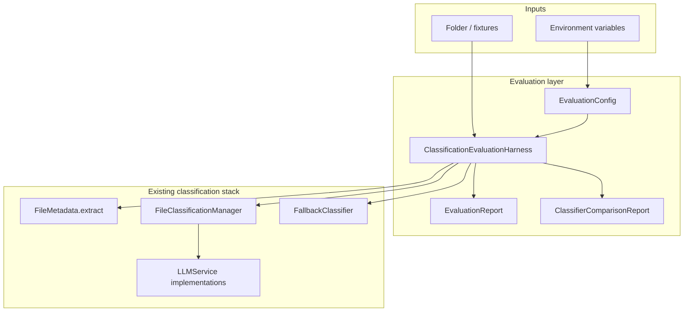
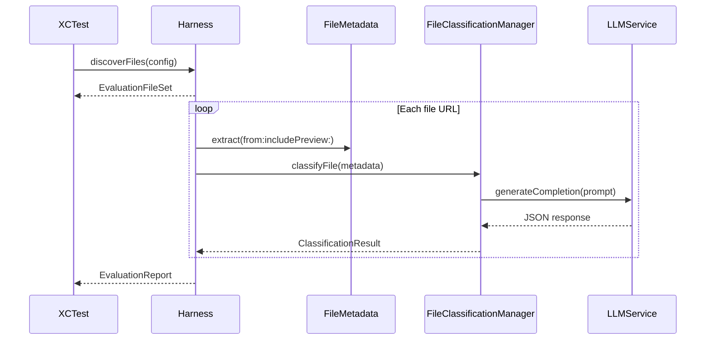
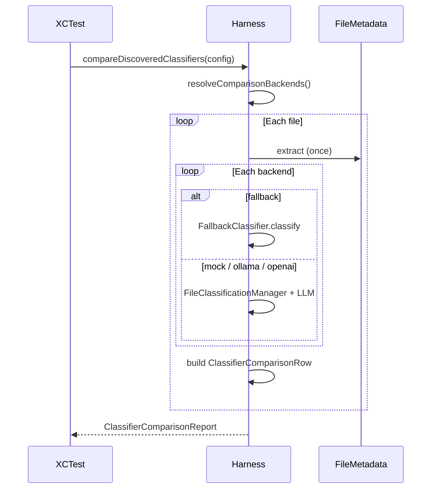

# Classification Evaluation — Design Document

**Status:** Implemented (Phase 0, Phase 1) · Planned (Phase 2 tuning, Phase 3 accuracy)  
**Last updated:** 2026-06-03  
**Operational guide:** [Testing/EVALUATION.md](../Testing/EVALUATION.md)

---

## Table of contents

1. [Problem and goals](#problem-and-goals)
2. [Scope](#scope)
3. [Architecture overview](#architecture-overview)
4. [Component design](#component-design)
5. [Data flow](#data-flow)
6. [Phase 1: classifier comparison](#phase-1-classifier-comparison)
7. [Configuration and environment](#configuration-and-environment)
8. [Alternatives considered](#alternatives-considered)
9. [Pros and cons of the chosen design](#pros-and-cons-of-the-chosen-design)
10. [Risks and limitations](#risks-and-limitations)
11. [Future work](#future-work)
12. [References](#references)

---

## Problem and goals

### Problem

The app supports multiple classification paths (`OllamaLLMService`, `OpenAILLMService`, `FailingLLMService`, `FallbackClassifier` via `FileClassificationManager`), but there was no **repeatable, comparable** way to:

- Run the same files through each backend
- Measure latency, confidence, and fallback usage
- Spot disagreements before changing prompts or shipping tuning changes
- Automate evaluation in CI without manual app runs

### Goals

| Goal | How we address it |
|------|-------------------|
| Single entry point for eval runs | `ClassificationEvaluationHarness` |
| Reproducible config | `EvaluationConfig` + env vars |
| CI without Ollama/OpenAI | Mock + Fallback always available; others auto-skipped |
| Real-folder evaluation | `EVAL_FOLDER` / `forHarnessTests()` → `~/Downloads` default |
| Side-by-side comparison | `compareClassifiers()` + `ClassifierComparisonReport` |
| Export for analysis | CSV / JSON / console report |

### Non-goals (current implementation)

- In-app “Compare mode” UI (deferred to optional Phase 1b)
- Ground-truth accuracy scoring (Phase 3)
- Multi-config Ollama tuning matrix (Phase 2)
- Persisting comparison history to disk (reports are in-memory / test output only)

---

## Scope

### Implemented

| Phase | Deliverable | Location |
|-------|-------------|----------|
| **0** | Shared harness, config, single-backend reports | `Models/Services/Evaluation/` |
| **0** | Harness tests | `Tests/EvaluationHarnessTests.swift` |
| **1** | Multi-backend comparison | `ClassifierComparison.swift`, harness extensions |
| **1** | Comparison tests | `Tests/ClassifierComparisonTests.swift` |

### Planned

| Phase | Deliverable |
|-------|-------------|
| **2** | Multi-config tuning runs, `ABTestingService` wiring |
| **3** | `labels.json` fixtures, strict/category accuracy % |

---

## Architecture overview

Evaluation sits **beside** production classification: it reuses `FileClassificationManager`, `FileMetadata`, and LLM services but does not change app UI flows.



### Design principles

1. **Reuse production code** — Same manager, prompt builder, and normalization as the app.
2. **Tests orchestrate, library executes** — XCTest calls the harness; business logic lives in the app target.
3. **Graceful degradation** — Missing Ollama/OpenAI skips backends instead of failing the whole run.
4. **Deterministic CI baseline** — Mock + Fallback always runnable; real LLMs optional.

---

## Component design

### `EvaluationConfig`

Holds folder path, `maxFiles`, Ollama model/temperature, `useExamples`, `promptVariant`, and `runLabel`.

| API | Purpose |
|-----|---------|
| `fromEnvironment()` | Parse `EVAL_*` / `QUICK_TUNING_FOLDER` |
| `forHarnessTests()` | `fromEnvironment()` + default `~/Downloads` if no folder set |
| `makeClassificationManager(llmService:)` | Wire prompt settings + manager |
| `makeOllamaService()` | Ollama instance from config |
| `resolvedOpenAIAPIKey()` | `OPENAI_API_KEY` or UserDefaults `openai_api_key` |

### `ClassificationEvaluationHarness`

| API | Purpose |
|-----|---------|
| `discoverFiles(config:)` | Depth-first scan; sample fixtures if empty |
| `evaluate(...)` | Single LLM backend via manager |
| `evaluateFallbackOnly(...)` | Rule-based only |
| `evaluateDiscoveredFiles(...)` | Discover + evaluate |
| `compareClassifiers(...)` | Multi-backend per file |
| `compareDiscoveredClassifiers(...)` | Discover + compare |
| `resolveComparisonBackends(...)` | Availability probe |
| `isOllamaAvailable()` | HTTP check to `localhost:11434` |

### `EvaluationReport` / `EvaluationRow`

One row per file per **single-backend** run. Aggregates: average confidence, average duration, fallback rate, category distribution. Exports: JSON, CSV, `printReport()`.

### `ClassifierComparisonReport` (Phase 1)

One row per file with **multiple** `ClassifierRunResult` entries (one per backend). Agreement rule: all successful, non-skipped backends share the same `category/subfolder` destination string.

| API | Purpose |
|-----|---------|
| `allAgree` (per row) | Same destination across ran backends |
| `agreementCount` / `disagreementCount` | Run-level summary |
| `exportCSV()` | Wide format: `{backend}_category`, …, `allAgree` |
| `printReport()` | Human-readable table with ✓/✗ |

### `ClassifierBackend`

| Backend | Implementation path | Availability |
|---------|---------------------|--------------|
| `mock` | `FileClassificationManager` + `MockLLMService` (delay 0) | Always |
| `fallback` | `FallbackClassifier.classify` | Always |
| `ollama` | Manager + `OllamaLLMService` from config | `isOllamaAvailable()` |
| `openai` | Manager + `OpenAILLMService` | API key present |

---

## Data flow

### Phase 0 — single backend



### Phase 1 — compare backends



**Ordering:** Files are processed sequentially; backends run sequentially per file. This avoids hammering Ollama/OpenAI with parallel requests and keeps logs readable.

---

## Phase 1: classifier comparison

### Agreement semantics

A row **agrees** when every backend that actually ran (no `error`, not `skipped`) produced the same `destinationPath` (`category/subfolder` after normalization).

| Situation | `allAgree` |
|-----------|------------|
| Mock and Fallback both → `Personal/General` | true |
| Mock → `Media/Photos`, Ollama → `Career/Books` | false |
| Only one backend ran successfully | true (trivial) |
| Metadata extraction failed | false paths; compared as empty/errors |

**Note:** Agreement is **structural**, not “correctness.” Two backends can agree on a wrong label.

### Backend skip behavior

Skipped backends are listed in `backendsSkipped` and are **not** included in agreement logic for that run. OpenAI is off by default in most tests (`includeOpenAI: false`) to avoid CI cost and network flakiness.

### Why Mock is included

Mock is useful for **fast regression** and CI, but its prompt-substring heuristics often disagree with Ollama on real PDFs (e.g. few-shot examples in prompts trigger `.jpg` paths). Treat Mock as a **pipeline smoke test**, not a quality benchmark.

---

## Configuration and environment

See [EVALUATION.md](../Testing/EVALUATION.md) for commands.

| Variable | Effect |
|----------|--------|
| `EVAL_FOLDER` | Primary folder for discovery |
| `EVAL_MAX_FILES` | Cap per run |
| `EVAL_MODEL` / `EVAL_TEMPERATURE` | Ollama comparison runs |
| `OPENAI_API_KEY` | Enables OpenAI backend when `includeOpenAI: true` |

`forHarnessTests()` ensures tests default to `~/Downloads` when env is unset, so `swift test` exercises real files when available.

---

## Alternatives considered

### 1. Test-only harness vs app-target module

| Option | Description |
|--------|-------------|
| **A (chosen)** | Harness types in `FileOrganizerApp` target under `Models/Services/Evaluation/` |
| **B** | All logic in `Tests/` only |
| **C** | Separate Swift package `FileOrganizerEvaluation` |

### 2. Comparison orchestration

| Option | Description |
|--------|-------------|
| **A (chosen)** | `compareClassifiers()` on existing harness |
| **B** | Separate `ClassifierComparisonRunner` class |
| **C** | Shell script invoking app CLI per backend |

### 3. Parallel vs sequential execution

| Option | Description |
|--------|-------------|
| **A (chosen)** | Sequential: files × backends |
| **B** | Parallel backends per file |
| **C** | Parallel files with rate limiting |

### 4. Agreement definition

| Option | Description |
|--------|-------------|
| **A (chosen)** | Full `category/subfolder` path after normalization |
| **B** | Category only (ignore subfolder) |
| **C** | Fuzzy match / embedding similarity |

### 5. Unavailable backends

| Option | Description |
|--------|-------------|
| **A (chosen)** | Auto-skip; report in `backendsSkipped` |
| **B** | `XCTSkip` entire test if Ollama down |
| **C** | Fail test if any requested backend missing |

### 6. Compare surface

| Option | Description |
|--------|-------------|
| **A (chosen)** | XCTest + CSV/console export |
| **B** | In-app compare sheet in `AIClassificationView` |
| **C** | Standalone CLI tool in `scripts/` |

---

## Pros and cons of the chosen design

### App-target harness (Option 1A)

| Pros | Cons |
|------|------|
| Production and eval share `FileClassificationManager` and normalization | Slightly larger app binary; eval code ships in app target |
| Tests stay thin; easy to add app UI later that calls same APIs | Cannot use `MockLLMService.fast()` from tests-only extensions in harness (uses `delay = 0` inline) |
| One source of truth for report shapes | Docs must distinguish “eval” vs “user-facing” features |

### Unified harness + comparison method (Option 2A)

| Pros | Cons |
|------|------|
| Single discovery/fixture path for all eval modes | `ClassificationEvaluationHarness.swift` grows; may split files later |
| Less duplication between `evaluate` and `compare` | Comparison logic coupled to harness lifecycle |
| Easy to add Phase 2 “compare configs” beside “compare backends” | |

### Sequential execution (Option 3A)

| Pros | Cons |
|------|------|
| Predictable logs; friendly to local Ollama | Slow on large folders × many backends (e.g. 10 files × 3 LLMs) |
| Avoids rate limits and race on shared `TelemetryService` | Does not stress-test concurrency |
| Simpler error attribution per file/backend | |

### Destination-path agreement (Option 4A)

| Pros | Cons |
|------|------|
| Matches user-visible filing outcome | Subfolder typos count as full disagreement |
| Aligns with `OrganizeDestination` path semantics | Category-only “close enough” matches not counted |
| Easy to explain in CSV (`allAgree` column) | Normalization can hide raw LLM differences |

### Auto-skip backends (Option 5A)

| Pros | Cons |
|------|------|
| `testCompareAll` passes in CI without Ollama | Machine without Ollama never exercises Ollama in that test unless dedicated test run |
| Clear `backendsSkipped` in report | Easy to misread “skipped” as failure |
| OpenAI opt-in via key + `includeOpenAI` | Inconsistent backend sets across machines complicate cross-team CSV compare |

### XCTest-first compare (Option 6A)

| Pros | Cons |
|------|------|
| No UI work; fits developer workflow | Non-developers need terminal + env vars |
| Fits `swift test --filter` CI jobs | Long Ollama runs can slow local test iterations |
| CSV export string ready for spreadsheet / Phase 3 | No persisted `comparison.csv` path unless test writes it |

### Including Mock in comparison

| Pros | Cons |
|------|------|
| Validates full LLM parse pipeline without network | Often disagrees with Ollama on real files; inflates `disagreementCount` |
| Fast baseline in CI | Can mislead if interpreted as “quality gap” |
| Same manager path as other LLM backends | Not representative of production Ollama/OpenAI behavior |

### Default `~/Downloads` in `forHarnessTests()`

| Pros | Cons |
|------|------|
| One command exercises real files | Non-deterministic across machines; privacy if Downloads sensitive |
| Empty Downloads → fixtures still work | CI machines may lack representative files |
| Matches user mental model (“test my Downloads”) | Harder to assert exact categories in tests |

---

## Risks and limitations

1. **Mock vs real LLM mismatch** — High disagreement counts are expected; document and filter Mock for “quality” reviews.
2. **Fake/sample PDFs** — Text files named `.pdf` cause CoreGraphics noise; prefer real PDFs or disable preview in eval config.
3. **Confidence ≠ accuracy** — Reports show model confidence; Phase 3 needed for labeled accuracy.
4. **OpenAI cost** — Comparison with `includeOpenAI: true` calls the API per file per run.
5. **UserDefaults in tests** — OpenAI key from app settings may not exist in headless CI.
6. **No persisted artifacts** — Tests print reports; saving CSV to disk is caller’s responsibility.
7. **Life-domain normalization** — All LLM backends go through `ClassificationConstants.normalizeLLMClassification`; comparisons reflect post-normalization paths.

---

## Future work

| Item | Phase | Notes |
|------|-------|-------|
| `OllamaTuningComparisonTests` — config matrix | 2 | Reuse harness; rank by confidence/latency |
| Wire `ABTestingService` into manager during eval | 2 | Variant per request |
| `labels.json` + accuracy metrics | 3 | Strict vs category accuracy |
| App “Compare classifiers” mode | 1b | Reuse `ClassifierComparisonReport` in UI |
| Optional `EVAL_WRITE_CSV` path | — | Write report to Downloads |
| Anthropic backend in `ClassifierBackend` | — | Symmetry with app service picker |
| Parallel backends with semaphore | — | If Ollama latency becomes bottleneck |

---

## References

| Document | Purpose |
|----------|---------|
| [EVALUATION.md](../Testing/EVALUATION.md) | Run commands, env vars |
| [DESIGN_DOCUMENT.md](./DESIGN_DOCUMENT.md) | Core classification architecture |
| [HOW_TO_TEST_CLASSIFIERS.md](../Testing/HOW_TO_TEST_CLASSIFIERS.md) | Legacy manual testing (pre-harness) |
| [LLM_CLASSIFICATION_REQUIREMENTS.md](../Guides/LLM_CLASSIFICATION_REQUIREMENTS.md) | Product requirements |

### Source files

```
FileOrganizerApp/Models/Services/Evaluation/
├── EvaluationConfig.swift
├── EvaluationModels.swift
├── ClassificationEvaluationHarness.swift
└── ClassifierComparison.swift

Tests/
├── EvaluationHarnessTests.swift
└── ClassifierComparisonTests.swift
```
