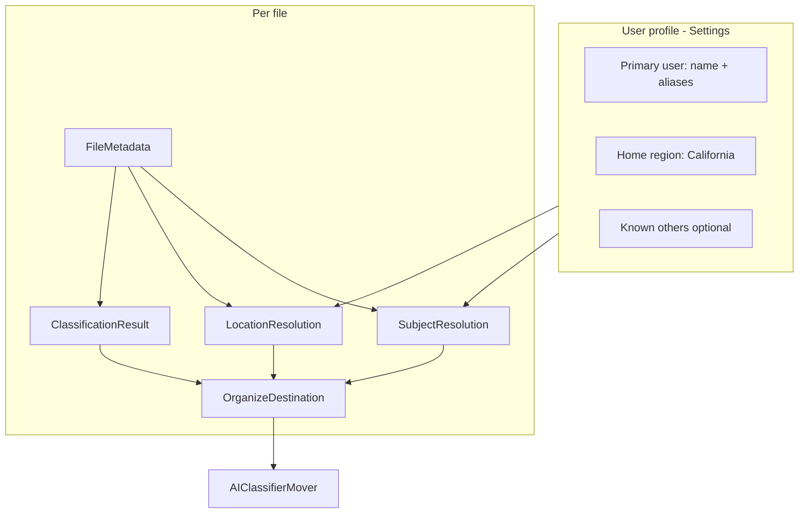
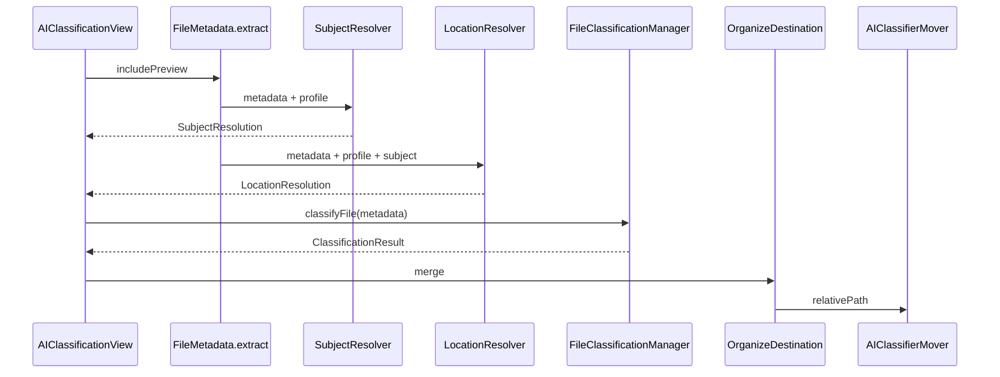
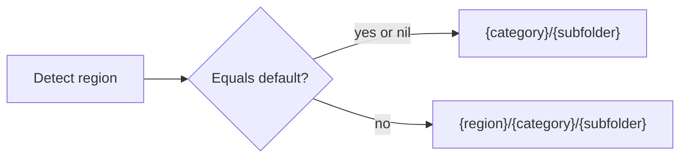

# Subject-aware & location-aware filing — design

Design for knowing **who the primary user is** (e.g. Mrinal Thigale, California) and filing documents **about other people** under their name, while keeping the existing **life-domain** taxonomy (`Career`, `Finance`, `Personal`, etc.).

**Status:** Approved for implementation (product decisions locked in §12).

---

## Table of contents

1. [Problem](#1-problem)
2. [Goals & non-goals](#2-goals--non-goals)
3. [Concepts](#3-concepts)
4. [Data model](#4-data-model)
5. [Subject detection pipeline](#5-subject-detection-pipeline)
6. [Folder path rules](#6-folder-path-rules)
7. [Component map](#7-component-map)
8. [Settings UX](#8-settings-ux)
9. [Run behavior & UI](#9-run-behavior--ui)
10. [Edge cases](#10-edge-cases)
11. [Privacy & security](#11-privacy--security)
12. [Product decisions (locked)](#12-product-decisions-locked)
13. [Phased delivery](#13-phased-delivery)
14. [Success criteria](#14-success-criteria)

---

## 1. Problem

The pipeline today answers: **“What kind of document is this?”**

It does **not** answer: **“Who is this document about?”** or **“Which jurisdiction / place does it belong to?”**

Current move path (two levels only):

```text
{baseTarget}/{category}/{subfolder}/{filename}
```

Example collisions from a mixed Downloads folder:

| File | Risk today |
|------|------------|
| `MrinalThigale-Resume.docx` | `Career/Resumes` ✓ |
| `RICHARDSON, JON-PAUL - 2023.xlsm` | Wrong domain or mixed with your career files |
| `Aadhaar-Mrinal.pdf` | `Personal/Identity` ✓ |
| `GSI Grievance_jon_paul.pdf` | Your `Legal/` vs Jon’s legal matter |

**Subject** and **location** must be separate axes from **category / subfolder**.

---

## 2. Goals & non-goals

### Goals

- Separate **your** documents from **named others**.
- Configurable **profile** (name, aliases, home region).
- **Default region in Settings** (e.g. California); **region folder segment only when a file’s detected region ≠ default** (see §6.0, §12.4).
- Deterministic rules first; optional LLM boost later.
- On-device profile storage.

### Non-goals (v1)

- Full household / dependency graph.
- Automatic NER on every binary type.
- Sending full SSN / street address to cloud LLMs.
- Legal determination of document ownership.

---

## 3. Concepts



| Concept | Meaning |
|---------|---------|
| **Primary user** | You — default subject when signals match profile |
| **Subject** | Person/org the document is primarily about |
| **Ownership** | `mine` · `other(person)` · `unknown` (see §12.2–12.3) |
| **Default region** | Set in Settings (`homeRegion`) — assumed for most of your files; **not** added to the path |
| **Detected region** | Per-file region from filename / preview / LLM |
| **Path region segment** | Folder name only if `detectedRegion ≠ defaultRegion`; otherwise omitted |
| **Life domain** | Existing `category` + `subfolder` (unchanged taxonomy) |

---

## 4. Data model

### 4.1 `UserProfile` (persisted)

```swift
struct UserProfile: Codable, Equatable {
    var fullName: String              // "Mrinal Thigale"
    var nameAliases: [String]         // "Mrinal", "Thigale", "MrinalThigale"
    var homeRegion: String?           // default region — set in Settings (e.g. "California")
    var homeRegionSlug: String?       // path-safe slug, derived from homeRegion
    var employers: [String]           // optional
    var emailDomains: [String]       // optional

    var enableSubjectFolders: Bool    // default true
    var othersRootFolderName: String  // default "Others"
}
```

**Default region behavior:** `homeRegion` is the baseline jurisdiction. It is used for classification hints and comparison. It is **not** repeated in every folder path. Only **non-default** detected regions become a path segment (§6.0).

**Storage:** `~/Documents/file_organizer_profile.json` (same pattern as `KeywordStore`).

### 4.2 `KnownPerson` (optional, phase 3)

```swift
struct KnownPerson: Codable, Identifiable {
    var id: UUID
    var displayName: String           // "Jon Richardson"
    var matchTokens: [String]         // "richardson", "jon-paul", "jon_paul"
    var relationship: String?         // "colleague", "estate", "family"
    var region: String?               // optional default region for their docs
}
```

### 4.3 `SubjectResolution`

```swift
enum DocumentOwnership: String, Codable {
    case mine
    case other
    case unknown    // treated as mine for paths — §12.2
}

struct SubjectResolution: Codable {
    let ownership: DocumentOwnership
    let primarySubjectName: String?
    let subjectSlug: String?
    let confidence: Double
    let method: SubjectMethod         // rules | llm | userOverride
    let signals: [String]
}
```

**Note:** No separate `household` path in v1 — joint/ambiguous cases use **mine path** (§12.3).

### 4.4 `LocationResolution`

```swift
struct LocationResolution: Codable {
    let detectedRegionSlug: String?   // raw detection: "California", "New-York", nil
    let pathRegionSegment: String?    // nil when detected == default or undetected
    let confidence: Double
    let method: LocationMethod        // filename | preview | llm | knownPerson
    let signals: [String]
}
```

`pathRegionSegment` is computed after detection:

```text
pathRegionSegment =
  nil                                    if homeRegion not set in Settings
  nil                                    if no region detected (implicit default)
  nil                                    if detectedRegion == homeRegionSlug
  detectedRegionSlug                     if detectedRegion != homeRegionSlug
```

### 4.5 `OrganizeDestination`

```swift
struct OrganizeDestination {
    let classification: ClassificationResult
    let subject: SubjectResolution
    let location: LocationResolution

    var relativePath: String { ... }  // see §6
}
```

`ClassificationResult` stays unchanged for LLM JSON parsing; subject/location are merged in app code.

---

## 5. Subject detection pipeline

### 5.1 `SubjectResolver`

```text
Input:  FileMetadata + UserProfile + [KnownPerson]
Output: SubjectResolution
```

**Priority:**

1. User override (future)
2. Known person token match
3. Filename name patterns (`LAST, FIRST`, estate names, `grievance_jon_paul`, etc.)
4. Content preview (“Employee:”, “Patient:”, “RE:”)
5. Profile-only match → `mine`
6. Default → `unknown` → **mine path** (§12.2)

### 5.2 Filename patterns (deterministic)

| Pattern | Example | Subject |
|---------|---------|---------|
| `LAST, FIRST` | `RICHARDSON, JON-PAUL - 2023.xlsm` | Jon Richardson |
| Profile tokens | `MrinalThigale-Resume.docx` | mine |
| Estate | `Neelmani_Singh_Estate_2022` | Neelmani Singh |
| Known token | `GSI Grievance_jon_paul` | Jon (via known list) |

**Scoring (simplified):**

```text
if score(other) > score(primary) + threshold → ownership = .other
else if score(primary) > 0           → ownership = .mine
else                                 → ownership = .unknown → mine path
```

### 5.3 `LocationResolver` (new)

```text
Input:  FileMetadata + UserProfile + SubjectResolution
Output: LocationResolution
```

**Signals:**

| Signal | Example |
|--------|---------|
| Settings default | `homeRegion` = California — used for comparison, not path prefix |
| Filename / preview | “State of New York”, “NY DMV” → `New-York` path segment |
| Filename / preview | “State of California”, “PG&E” → matches default → **no** region segment |
| Known person | `KnownPerson.region` if set and ≠ default |
| Undetected | `pathRegionSegment = nil` (implicit default) |

Region is a **folder dimension only when non-default** (§12.4). Default region still feeds the LLM/classifier as context.

### 5.4 LLM assist (phase 4, optional)

Optional JSON fields (separate from category/subfolder):

```json
{
  "subjectOwnership": "mine|other|unknown",
  "subjectName": "Jon Richardson",
  "region": "California"
}
```

If LLM disagrees with rules and confidence &lt; 0.85, prefer **rules** for path construction.

### 5.5 Interaction with classification

- **Life domain** (tax, health, career): existing `FileClassificationManager` + taxonomy.
- **Subject + location**: applied only when building `OrganizeDestination.relativePath`.
- When `ownership == .other`, do not apply `Personal/Identity` rules meant for **your** IDs unless the subject is still you.



---

## 6. Folder path rules

Locked decisions from §12 shape all paths.

### 6.0 Region: omit default (core rule)

**Settings → Default region** (e.g. `California`) defines what “home” means.

| Detected region vs default | Path includes region? | Example path (domain only shown) |
|--------------------------|------------------------|----------------------------------|
| Not set in Settings | Never | `Finance/Taxes/file.pdf` |
| No signal / implicit default | No | `Finance/Taxes/file.pdf` |
| Detected == default (CA) | **No** | `Finance/Taxes/file.pdf` |
| Detected != default (NY) | **Yes** | `New-York/Finance/Taxes/file.pdf` |

This keeps the common case flat (`Finance/Taxes/…`) while surfacing **other** jurisdictions explicitly (`New-York/…`, `India/…`).



### 6.1 Path matrix

Let `R = location.pathRegionSegment` (nil when default or undetected). Let `domain = {category}/{subfolder}`.

| Ownership | Relative path |
|-----------|---------------|
| `mine` | `R/domain/file` if `R != nil`, else `domain/file` |
| `unknown` | Same as **mine** (§12.2) |
| `other` | `Others/{subjectSlug}/R/domain/file` if `R != nil`, else `Others/{subjectSlug}/domain/file` |

**No `Mine/` prefix** (§12.1).

**No `Household/` tree** (§12.3).

**No default region in path** — California is not prefixed on every file when it is the Settings default.

### 6.2 Examples (profile: Mrinal Thigale, default region **California**)

```text
W-2_Form_2023_Mrinal-Quotient.pdf
  → Finance/Taxes/W-2_Form_2023_Mrinal-Quotient.pdf
  (CA implied; no region segment)

MrinalThigale-Resume.docx
  → Career/Resumes/MrinalThigale-Resume.docx

Visa2024.pdf with India detected in preview
  → India/Legal/Immigration/Visa2024.pdf
  (non-default region → segment present)

RICHARDSON, JON-PAUL - 2023.xlsm
  → Others/Jon Richardson/Career/Work/RICHARDSON, JON-PAUL - 2023.xlsm
  (no CA segment if Jon’s doc has no non-default region signal)

GSI Grievance_jon_paul (1).pdf  (California in text)
  → Others/Jon Richardson/Legal/Court Cases/...
  (detected CA == default → no region under Others)

(Neelmani_Singh_Estate_2022)_Tax_Relief_USA.zip
  → Others/Neelmani Singh/Finance/Taxes/...
```

### 6.3 `OrganizePathBuilder` (pseudocode)

```swift
func pathRegionSegment(
    profile: UserProfile,
    location: LocationResolution
) -> String? {
    guard profile.homeRegionSlug != nil else { return nil }
    return location.pathRegionSegment  // already nil when == default
}

func relativePath(profile: UserProfile) -> String {
    let domain = "\(classification.category)/\(classification.subfolder)"
    let R = pathRegionSegment(profile: profile, location: location)

    switch subject.ownership {
    case .mine, .unknown:
        if let R { return "\(R)/\(domain)" }
        return domain

    case .other:
        let root = profile.othersRootFolderName
        let person = subject.subjectSlug ?? "Unknown"
        if let R { return "\(root)/\(person)/\(R)/\(domain)" }
        return "\(root)/\(person)/\(domain)"
    }
}
```

### 6.4 Slug rules

- `regionSlug`: alphanumeric + hyphens; e.g. `California`, `New-York`
- `subjectSlug`: display name sanitized; collision → `Jon Richardson (2)`

---

## 7. Component map

| Component | Path |
|-----------|------|
| `UserProfile`, `KnownPerson` | `Models/Core/UserProfile.swift` |
| `SubjectResolution`, `LocationResolution`, `OrganizeDestination` | `Models/Core/` |
| `ProfileStore` | `Models/Storage/ProfileStore.swift` |
| `SubjectResolver` | `Models/Services/Classification/SubjectResolver.swift` |
| `LocationResolver` | `Models/Services/Classification/LocationResolver.swift` |
| `OrganizePathBuilder` | `Models/Services/Classification/OrganizePathBuilder.swift` |
| `ClassificationConstants` | name/region helpers |
| `AIClassifierMover` | use `OrganizeDestination.relativePath` |
| `SettingsView` | “About me” + known others |
| `AIClassificationView` | load profile; show full path in progress |
| `ClassificationPromptBuilder` | profile + region blurb (phase 4) |

---

## 8. Settings UX

```text
┌─ About me ─────────────────────────────────────┐
│ Full name:     [ Mrinal Thigale            ]   │
│ Also called:   [ Mrinal, Thigale, ...      ]   │
│ Default region: [ California             ]   │  ← §12.4: assumed home; not in every path
│   (Only other regions become folder names,   │
│    e.g. New-York/Finance/…)                  │
│ Employers:     [ Quotient, Avaya           ]   │
│ ☑ File other people's documents separately     │
│   Others folder name: [ Others ]             │
└────────────────────────────────────────────────┘

┌─ Known other people (optional) ────────────────┐
│ • Jon Richardson  — richardson, jon-paul        │
│ • Neelmani Singh  — neelmani, singh, estate     │
└────────────────────────────────────────────────┘
```

Require **full name or alias** when subject folders are enabled. Default region is optional but recommended for location detection.

---

## 9. Run behavior & UI

| Stage | Log / UI |
|-------|----------|
| Classify | `🔵 Classifying: file.pdf` |
| Result | `✅ file.pdf → Finance/Taxes (0.95)` *(default region — no CA prefix)* |
| Non-default region | `✅ file.pdf → New-York/Finance/Taxes (0.88)` |
| Other | `✅ file.pdf → Others/Jon Richardson/Legal/Court Cases (0.91)` |
| Low subject confidence | Flag for review; still **mine path** if unknown (§12.2) |

CSV export columns: `relativePath`, `ownership`, `subjectName`, `region`.

---

## 10. Edge cases

| Case | Behavior |
|------|----------|
| Both names in filename | Higher score wins; if tie → **mine path** (§12.3) |
| Reference letter for you | `mine` + `Career/Work` |
| Company + your name (`Coinbase-8949-Mrinal.pdf`) | `mine` |
| No preview | Filename + profile only |
| Detected region == default | Omit region segment (flat `domain`) |
| Default region not set in Settings | Never add region segment; detection disabled for paths |
| PG&E / CA agency, default CA | No `California/` prefix |
| Duplicate paths | Timestamp suffix (existing mover behavior) |

---

## 11. Privacy & security

- Profile JSON **local only**.
- Cloud LLM: minimal prompt blurb (name tokens + region label), not full profile file.
- Ollama: may include full local profile.
- Telemetry: prefer `ownership` enum + region slug; avoid logging full legal names unless user opts in.

---

## 12. Product decisions (locked)

| # | Question | **Decision** |
|---|----------|--------------|
| **12.1** | Path for your files | **Keep flat domain** — no `Mine/` prefix. Usual path: `{category}/{subfolder}` when region is default or undetected. |
| **12.2** | Unknown ownership | **Mine path** — `unknown` uses the same paths as `mine`. |
| **12.3** | Joint / household | **Mine path** — no separate `Household/` tree. |
| **12.4** | Location / region | **Default region in Settings** (e.g. California). Region is a **folder dimension only when detected region ≠ default**. Default is **not** prefixed on every path. Non-default examples: `New-York/Finance/Taxes/`, `Others/Jon Richardson/India/Legal/…`. |

These supersede any earlier “open questions” in chat; implementation must follow §6.

---

## 13. Phased delivery

| Phase | Scope |
|-------|--------|
| **1** | `UserProfile`, `ProfileStore`, Settings (“About me” + region) |
| **2** | `SubjectResolver`, `OrganizePathBuilder`, mover paths, §12.1–12.3 |
| **3** | `LocationResolver`, omit-default path logic, `pathRegionSegment` (§6.0, §12.4) |
| **4** | Known others CRUD + token matching |
| **5** | LLM `subjectName` / `region` fields + review UI |

---

## 14. Success criteria

Using profile: **Mrinal Thigale**, **California**, mixed Downloads:

- Your W-2, Aadhaar, resume (CA/default) → `{Finance|Career|Personal}/…` — **no** `California/` prefix.
- Foreign / other-state doc (e.g. India visa) → `{NonDefaultRegion}/{domain}/…`.
- `RICHARDSON, JON-PAUL*`, `GSI Grievance_jon_paul*` (CA/default) → `Others/Jon Richardson/{domain}/…`.
- `Neelmani_Singh_Estate*` → `Others/Neelmani Singh/Finance/…` unless a non-default region is detected.
- Life-domain taxonomy unchanged; **non-default region** and **other person** are optional prefix segments only.

---

## Revision history

| Date | Change |
|------|--------|
| 2026-05-21 | Initial design; §12 locked per product input |
| 2026-05-21 | §12.4 refined: region path segment only when ≠ Settings default; §6.0 omit-default rule |
| 2026-05-21 | **Implemented** in app: ProfileStore, SubjectResolver, LocationResolver, OrganizePathBuilder, Settings “About me”, AIClassifierMover paths |
